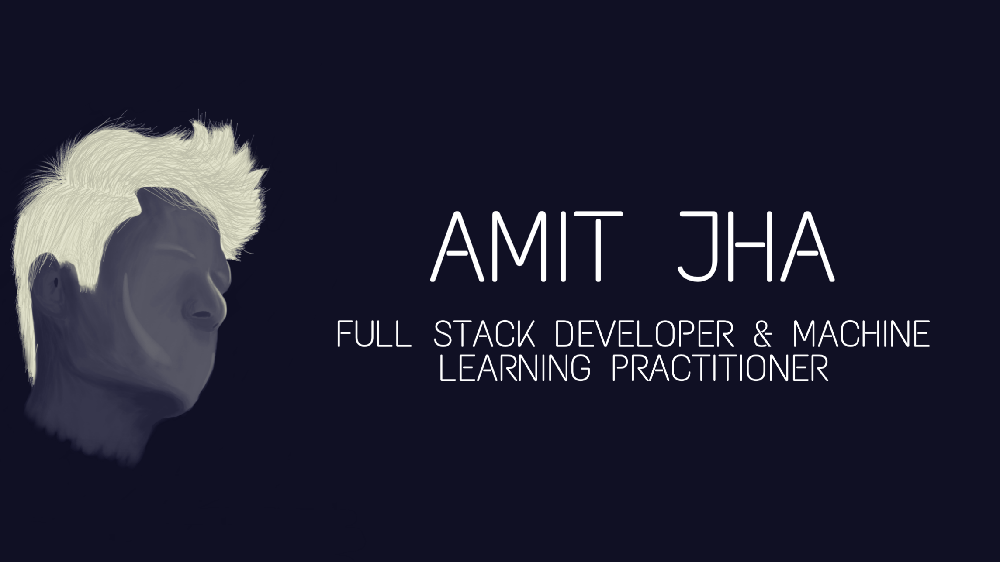

# Hi there everyone 👋

<!--
**devbihari/devbihari** is a ✨ _special_ ✨ repository because its `README.md` (this file) appears on your GitHub profile.

Here are some ideas to get you started:

- 🔭 I’m currently working on ...
- 🌱 I’m currently learning ...
- 👯 I’m looking to collaborate on ...
- 🤔 I’m looking for help with ...
- 💬 Ask me about ...
- 📫 How to reach me: ...
- 😄 Pronouns: ...
- ⚡ Fun fact: ...
-->

I'm a full stack developer who is passionate to build quality products to help users engage with platforms/applications seamlessly. Apart from being a __Full Stack Developer__ I'm also a __Machine Learning Practitioner__. My main focus in machine learning is to build deployable machine learning solutions to interesting problems which can be deployed as a __Docker Container__.

I'm currently working on several projects to improve student interaction with schools/colleges and enriching their knowledge with quality content.

Additionally, I'm also spending as much time possible on enhancing my skills around __Django Advanced Concepts__ such as __Django Connect__, __Authentication Protocols__, __Dockerization of machine learning models__. Lastly, I'm spending learning advanced machine learning concepts such as __GANs, NLP, RL etc__.

If you have anything interesting you think we should be working on you can contact me by raising a token in the issues here [/devbihari](https://github.com/devbihari/devbihari/issues). Looking forward to hearing from you.